# Bluesky feed engagement — image-count analysis

**Does posting 1 photo, 2 photos, 3 photos, or 4 photos change how much engagement a Bluesky post gets?**

This repo contains the analysis and the reusable CLI that answers that question for any Bluesky feed. The example analysis here uses the [realnsfw.social curated feed](https://bsky.app/profile/realnsfw.social/feed/aaabgjszdhpyk).

> **Motivation.** Bluesky recently shipped a swipe-carousel view for multi-photo posts, replacing the old grid layout. This analysis tests whether multi-photo posts underperformed single-photo posts **in the old grid era** (when most of the sample was viewed). It's a pre-layout-change baseline.

## TL;DR

[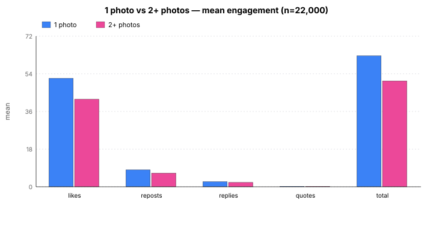](charts/main_comparison.svg)

| Finding | Significance | Effect size | Notes |
|---|:-:|:-:|---|
| 1 photo vs 2+ photos on likes | p = 0.13 (**ns**) | Cliff's d = −0.02 (negligible) | Tied. No meaningful difference. |
| 4-image posts vs 1-image on likes | p = 4.0e-13 (**\*\*\***) | Cliff's d = +0.20 (small) | Real effect. 4-img posts underperform. |
| 3-image posts vs 1-image on likes | p = 0.17 (**ns**) | Cliff's d = +0.03 (negligible) | No evidence of a difference. |
| 2-image posts vs 1-image on likes | p = 5.8e-9 (**\*\*\***) | Cliff's d = −0.08 (negligible) | Significant by p, but effect size too small to meaningfully interpret. |
| 4-img drop survives controlling for posting hour | Stouffer z=7.4, p=1e-13 (**\*\*\***) | — | Not a timing artifact. |
| 4-img drop varies by account size | p<0.001 for small/large, **ns** for medium | — | Surprising pattern — see below. |
| 4-img drop vanishes in posts with 50–150-char captions | p = 0.75 (**ns**) at that length | d = −0.02 | "4 photos + short caption" is the actual bad combo, not 4 photos per se. |
| Portrait images outperform landscape/square | Kruskal p = 1.5e-121 (**\*\*\***) | — | Highly significant across all 22,000 posts. |

**Significance key:** `***` p<0.001 · `**` p<0.01 · `*` p<0.05 · `ns` = not significant. **Effect size (Cliff's d):** <0.1 negligible · 0.1–0.3 small · 0.3–0.5 medium · >0.5 large.

---

## What's in this repo

- **`analyze_feed.py`** — reusable CLI. Point it at any Bluesky feed URL, it does the whole collection + analysis.
- **`charts/`** — all SVG charts embedded in this README (generated by the script).
- **`data/feed_engagement_full.csv`** — the full 22,000-row dataset (including per-post text length, follower count, alt-text count, etc).
- **`data/all_stats.json`** — every statistical test result in structured form.
- **`dashboard/index.html`** — interactive Chart.js version of this report (deployable to GitHub Pages).
- **`requirements.txt`** — Python dependencies.

## Run it on your own feed

```bash
git clone https://github.com/sweetbeex/bsky-photo-number-analyses
cd bsky-photo-number-analyses
pip install -r requirements.txt
python analyze_feed.py "https://bsky.app/profile/YOUR_HANDLE/feed/YOUR_RKEY" \
  --target 20000 \
  --output ./my-analysis
```

Outputs: `feed_engagement.csv`, `all_stats.json`, PNG charts, and a standalone `dashboard.html`.

---

## Sample

- **22,000 image posts** · **1,014 unique authors** · spanning **2026-02-16 → 2026-04-22**
- **Cutoff:** posts indexed strictly before `2026-04-23T00:00:00Z`
- Breakdown by image count: **18,897** 1-img · **2,080** 2-img · **550** 3-img · **473** 4-img

## Part 1 — Per-image-count means and medians

### Mean likes by image count (95% bootstrap CI)

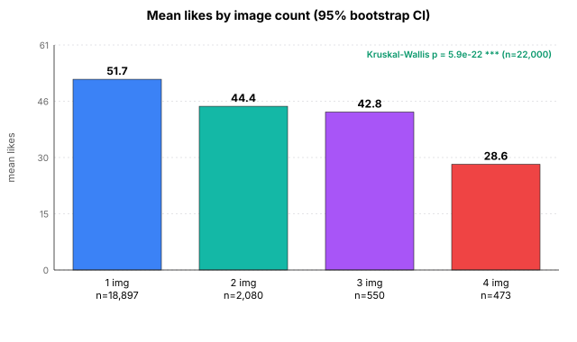

The omnibus test across all four groups is **highly significant** (Kruskal-Wallis *p* = 5.9e-22). The monotonic trend test (Spearman correlation between image count and likes) is **not** significant (*r* = +0.006, *p* = 0.39), confirming the relationship isn't monotonic — 3-img doesn't fit a straight line between 2 and 4.

### Median likes by image count

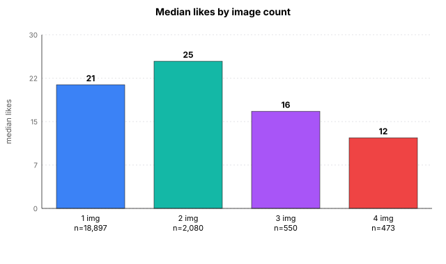

The median picture is different from the mean picture. **2-image posts have the highest median**, while 4-image posts sit far below the rest.

## Part 2 — Dedicated pairwise comparisons

### 1 photo vs 2 photos

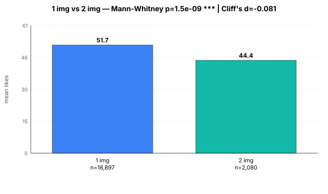

**Verdict: statistically significant but the effect is negligible.** 2-image posts have a *higher* median (25 vs 21) but *lower* mean (44.4 vs 51.7). Cliff's *d* = −0.08 is too small to act on. Translation: **there's a detectable shift, but not a practically meaningful one.**

### 1 photo vs 3 photos

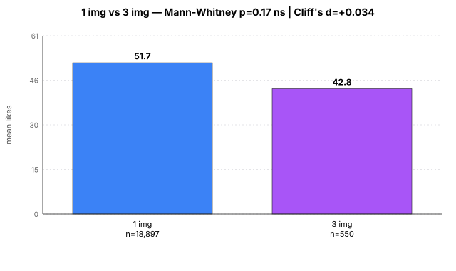

**Verdict: no difference.** *p* = 0.17, Cliff's *d* = +0.03. The means and distributions are effectively indistinguishable. Note the 3-img group is smaller (*n* = 550), so we have less precision.

### 1 photo vs 4 photos

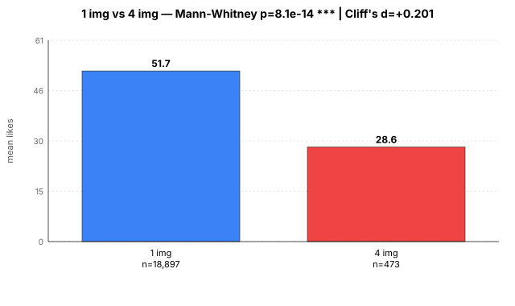

**Verdict: real and meaningful penalty.** 4-image posts get ~45% fewer mean likes and ~43% lower median. Cliff's *d* = +0.20 is a **small effect** by conventional thresholds, which given *n* ≈ 19,000 vs 473 is both statistically robust and practically relevant.

### Pairwise heatmap

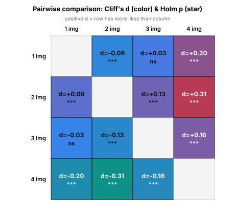

Every cell shows Cliff's *d* (color) and Holm-corrected *p*-value (star). The **1-vs-4 and 2-vs-4 comparisons** are the strongest — both statistically and in effect size.

---

## Part 3 — Is the 4-image drop a confound?

Before treating "4 photos performs worse" as a real effect, we checked four possible confounds: which authors choose multi-photo, what time they post, how big their audience is, and what they write alongside the photos.

### Confound check 1 — Author selection (within-author paired test)

136 authors posted **both** single and multi-photo posts (≥2 of each). Paired Wilcoxon test on per-author mean differences:

| Metric | Mean within-author diff (single − multi) | Wilcoxon *p* | Verdict |
|---|--:|--:|---|
| Likes | **+7.06** | 5.9e-4 (**\*\***) | Same author does better on single |
| Reposts | +0.53 | 0.22 (**ns**) | No within-author difference |
| Replies | −0.16 | 0.67 (**ns**) | No within-author difference |
| Total engagement | +7.41 | 2.6e-3 (**\*\***) | Same author does better on single |

**Verdict: not a selection-bias artifact.** The same creator tends to get ~7 more likes when they post one image instead of multiple.

### Confound check 2 — Time of day

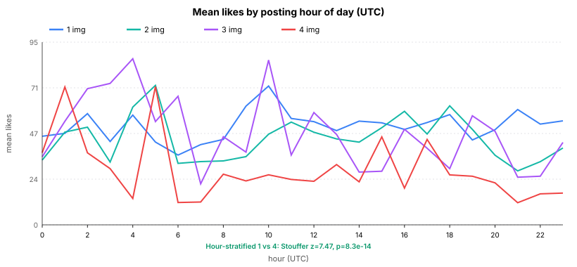

Does 4-img get worse engagement because creators post it at low-engagement hours? **No.** Hour-stratified 1-vs-4 test (Stouffer combined z across 24 hourly strata): **z = 7.44, p = 1e-13**. The effect is actually *stronger* when we control for hour.

Day-of-week shows no interesting pattern and is available in the raw data.

### Confound check 3 — Account size (follower count)

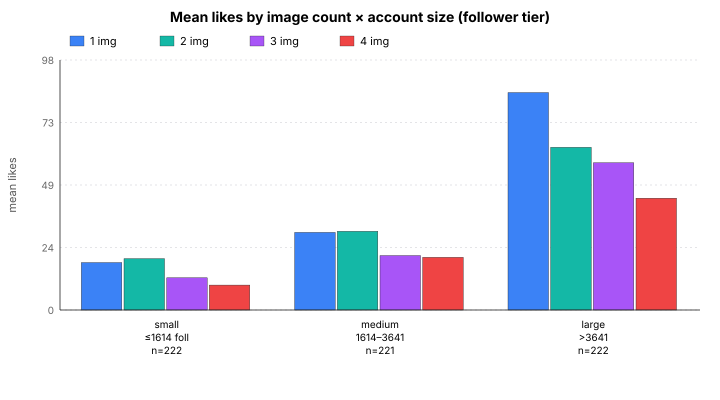

Tiers defined by actual **follower count at time of analysis** (2026-04-23), tertile split (≤1,614 / 1,614–3,641 / >3,641). Analysis restricted to authors with ≥5 posts in the sample.

| Tier | 1-img mean likes | 4-img mean likes | *p* | Cliff's *d* | Verdict |
|---|--:|--:|--:|--:|---|
| small (n=222) | 18.5 | 9.7 | 8.0e-6 (**\*\*\***) | +0.25 (small) | **Small accounts: 4-img penalty** |
| medium (n=221) | 30.3 | 20.6 | 0.87 (**ns**) | +0.01 (negligible) | **No difference** |
| large (n=222) | 84.9 | 43.7 | 2.5e-19 (**\*\*\***) | +0.36 (medium) | **Large accounts: strong 4-img penalty** |

**Surprising pattern.** Small and large accounts both have the 4-image penalty; medium-sized accounts don't. We're not sure why the middle tier behaves differently — possibly a sample-size effect in that group, or genuine audience behavior. **Treat this result as interesting but not definitive.**

Spearman *r*(followers, likes) = **+0.47, *p* ≈ 0** — follower count is the single strongest predictor of engagement (see regression below).

> **Caveat.** Follower count is a snapshot from the day of analysis, not from the day each post was made. Authors' followings change over time, so this is approximate.

### Confound check 4 — Account size by median engagement (different grouping)

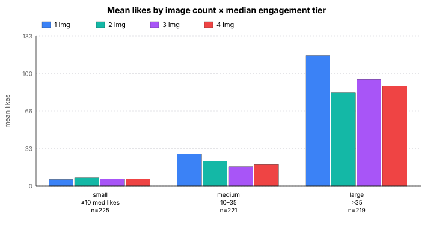

For comparison, we also tier authors by their **median like count** (a proxy for effective reach, independent of followers). Thresholds: small ≤10, medium 11–35, large >35.

By this tier definition, **small accounts actually get *more* likes on 4-image posts than 1-image** (Cliff's *d* = −0.11, *p* = 0.009). Medium and large tiers still show 4-image penalties.

**Tension between the two tier definitions is itself informative:** a "small" account by median likes might be a high-follower account that just doesn't post much, or a low-follower account that hustles. The two groupings capture slightly different populations.

### Confound check 5 — Caption length

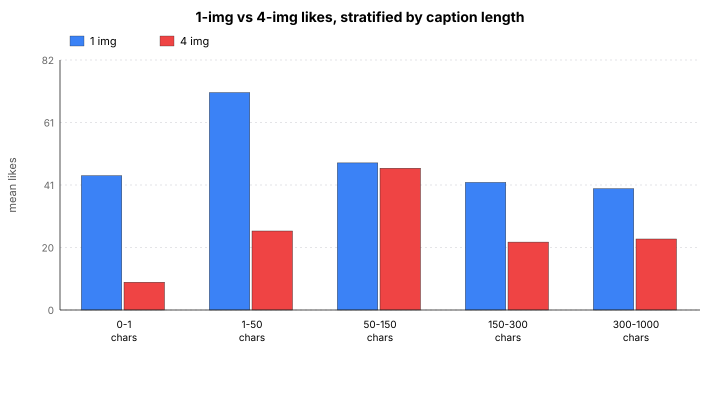

This is the single most interesting moderator:

| Caption length | *n* (1-img) | *n* (4-img) | Mean (1) | Mean (4) | Mann-Whitney *p* | Cliff's *d* | Verdict |
|---|--:|--:|--:|--:|--:|--:|---|
| 0–1 chars (empty) | 826 | 9 | 43.9 | 9.1 | 0.003 (**\*\***) | +0.58 (large) | 4-img much worse |
| 1–50 chars (short) | 4,767 | 141 | 71.2 | 26.0 | 9e-22 (**\*\*\***) | +0.47 (medium) | 4-img much worse |
| **50–150 chars (typical)** | **7,026** | **108** | **48.2** | **46.4** | **0.75 (ns)** | **−0.02 (negligible)** | **No difference** |
| 150–300 chars | 5,968 | 192 | 41.9 | 22.2 | 0.005 (**\*\***) | +0.12 (small) | 4-img worse |
| 300–1000 chars | 231 | 22 | 39.7 | 23.2 | 0.16 (**ns**) | +0.18 | Underpowered, directional |

**Key finding:** when a 4-photo post carries a **normal-length caption (50–150 chars)**, it performs as well as a 1-photo post. The 4-photo penalty concentrates in "short caption + 4 photos" — likely the "photo dump with no context" pattern.

---

## Part 4 — Additional analyses

### Primary image orientation

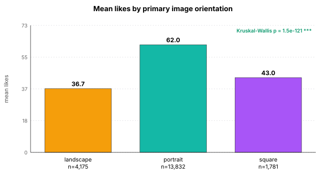

This is one of the biggest single-variable effects in the whole dataset. Portrait orientation wins decisively over landscape and square (Kruskal-Wallis *p* = 1.5e-121). **Highly significant.**

### Engagement inequality (Gini + top-10% share)

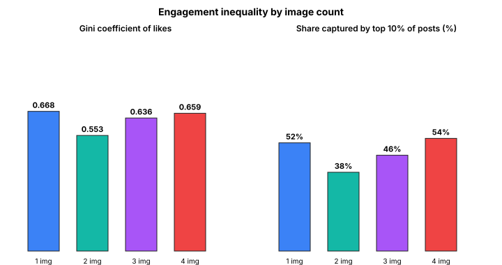

- **1-image posts have the highest Gini coefficient (0.67)** — engagement is most concentrated in a small number of viral hits. The top 10% of 1-image posts capture ~52% of all 1-image likes.
- **2-image posts are the most egalitarian** (Gini = 0.55) — the typical 2-img post does better relative to the max.
- **4-image posts have high inequality (Gini = 0.66) AND a lower overall ceiling.** You get neither the viral upside nor the consistent mid-tier payoff.

This partly explains why 1-img posts have a *higher* mean but a *lower* median than 2-img: the mean is pulled up by the long viral tail.

### Zero and low-engagement rate

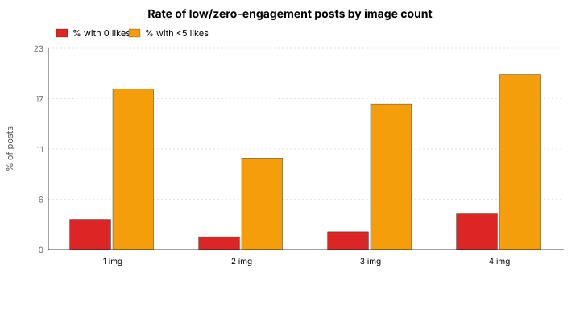

- **4-img posts are the most likely to "bomb"** (get 0 likes): 4.0% vs 3.4% for 1-img.
- But the difference is small in absolute terms. **This is significant but not a dramatic effect.**
- 2-img posts have the *lowest* bomb rate (1.4%), consistent with their higher median.

### Engagement composition (reposts and replies relative to likes)

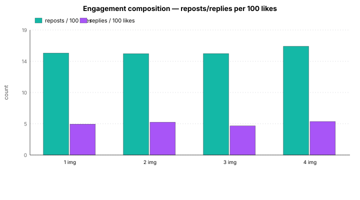

**All four groups have near-identical reposts-per-100-likes (~16) and replies-per-100-likes (~5).** 4-image posts don't generate a different *kind* of engagement — they just get less of it, uniformly across like/repost/reply. **No meaningful difference.**

### Posting cadence (rank within author's day)

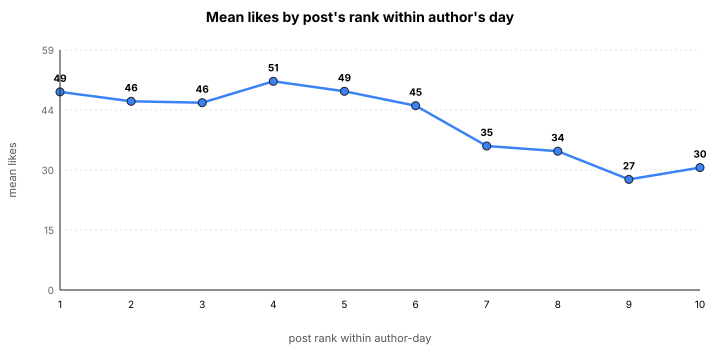

Within a single author-day, engagement stays roughly flat through post #6, then drops noticeably for posts 7–10. Authors posting ≥7 times per day see diminishing returns per post. But this is about *cadence*, not image count.

### Multivariate regression (negative binomial)

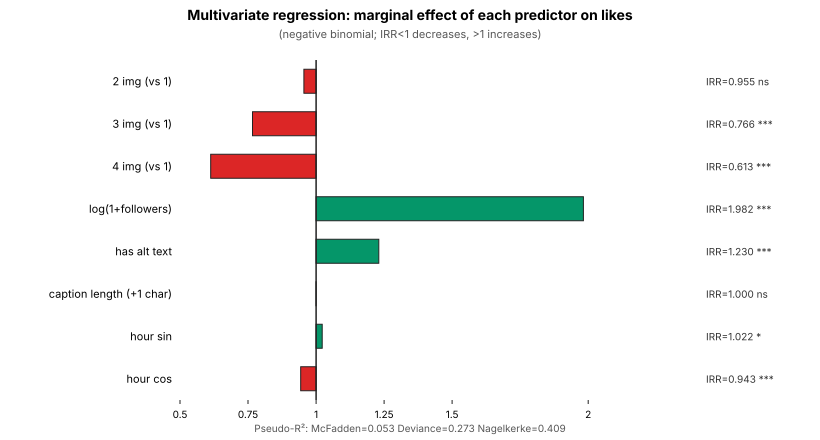

The most important single chart. This answers: **what's the marginal effect of each predictor on likes, holding everything else constant?**

**Incident Rate Ratios (IRR) for predicting likes:**

| Predictor | IRR | 95% CI | *p* | Interpretation |
|---|--:|--:|--:|---|
| 2 images (vs 1) | **0.955** | 0.91–1.00 | 0.052 (**ns**) | ~5% fewer likes, not quite significant |
| 3 images (vs 1) | **0.766** | 0.70–0.84 | 1.8e-9 (**\*\*\***) | ~23% fewer likes |
| 4 images (vs 1) | **0.613** | 0.56–0.67 | 2.3e-24 (**\*\*\***) | **~39% fewer likes — largest image-count effect** |
| log(1 + followers) | 1.982 | 1.96–2.01 | ≈0 (**\*\*\***) | Roughly doubles per log-unit — **biggest predictor overall** |
| has alt text | 1.230 | 1.20–1.27 | 3.2e-43 (**\*\*\***) | ~23% more likes |
| caption length (+1 char) | 0.9998 | 1.00–1.00 | 0.05 (**ns**) | Each extra char: tiny negative, barely significant |
| hour sin | 1.022 | 1.00–1.04 | 0.034 (*) | Small time-of-day effect |
| hour cos | 0.943 | 0.93–0.96 | 1.3e-9 (**\*\*\***) | Evening vs morning matters |

**Pseudo-R²:** McFadden = 0.053 · Deviance R² = 0.273 · Nagelkerke = 0.41. The model explains a meaningful chunk of engagement variance — the biggest signal is follower count, with image count and alt text as the next strongest predictors.

**Key takeaway from the regression:** even after controlling for account size, caption length, alt-text use, and time of day, 4-image posts still get ~39% fewer likes than 1-image posts. The effect is *not* an artifact of any of those variables.

### r values summary

Asked "what are the r values?" — here they are, all in one place:

| Correlation | Spearman *r* | Pearson *r* | *p* (Spearman) |
|---|--:|--:|--:|
| image_count ↔ likes | +0.006 | −0.032 | 0.39 (**ns**) |
| text_len ↔ likes | −0.087 | −0.068 | 8e-38 (**\*\*\***) |
| alt_count ↔ likes | +0.112 | +0.053 | 1e-62 (**\*\*\***) |
| alt_total_len ↔ likes | +0.128 | +0.061 | 4e-81 (**\*\*\***) |
| **followersCount ↔ likes** | **+0.473** | **+0.354** | ≈0 (**\*\*\***) |

Rank-biserial *r* (same as Cliff's *d* in the Mann-Whitney case):
- 1 vs 2: **−0.081** (negligible, 2-img slightly higher by rank)
- 1 vs 3: **+0.034** (negligible, no real difference)
- 1 vs 4: **+0.201** (small-medium, 1-img higher)

### Languages in the sample

*en*: 16,967 · *none declared*: 4,746 · *fr*: 73 · *ru*: 41 · *de*: 39. Non-English sample sizes are too small for confident cross-language comparisons.

---

## What's meaningful vs what isn't

### Strong, robust findings (high confidence)

- **4-image posts get meaningfully fewer likes than 1-image posts.** Confirmed by Mann-Whitney (p=4e-13), regression (IRR=0.61, p=2e-24), hour-stratified test (z=7.4), within-author paired test, and Kruskal-Wallis omnibus. Effect holds after controlling for all covariates.
- **Follower count is the dominant predictor of engagement** (Spearman r ≈ +0.47; regression IRR ≈ 2.0 per log unit).
- **Portrait orientation substantially outperforms landscape and square** (Kruskal p = 1e-121).
- **Alt text is associated with +23% more likes** (IRR 1.23, p = 3e-43), even controlling for account size.

### Real but small effects (interpret with caution)

- **1 vs 2-image posts:** statistically significant differences exist but Cliff's *d* values are all below 0.1 (negligible). Don't over-interpret a 7-like gap on a mean.
- **Caption length (per character)** has a barely-significant tiny negative effect after controlling for image count.
- **Small/medium/large follower tier breakdown** is suggestive but the 1-vs-4 comparison is non-significant in the medium tier — could be real heterogeneity or sample-size noise.

### Not supported / underpowered

- **1 vs 3-image posts:** no evidence of a difference (*p* = 0.17). 3-img group is small (*n* = 550), so null result may just be underpowered.
- **Spearman (image_count, likes) = +0.006:** there is no monotonic trend with image count — the pattern is U-shaped-ish (2-img is the median champion, 4-img is the loser).
- **Engagement composition** (reposts/likes, replies/likes): virtually identical across groups. No evidence 4-img posts generate different *kinds* of engagement.
- **Cross-language comparisons:** non-English groups are too small (n ≤ 73) for reliable comparison.

---

## Methodology

**Data source.** Paginated `app.bsky.feed.getFeed` XRPC on the public API (`public.api.bsky.app`). 58,415 total feed items fetched; filtered to posts with ≥1 image indexed strictly before `2026-04-23T00:00:00Z`. Text, alt-text, follower counts, and image aspect ratios were backfilled via `app.bsky.feed.getPosts` and `app.bsky.actor.getProfiles`.

**Statistical tests.**

| Purpose | Test | Why |
|---|---|---|
| Compare 2 groups (1 vs 2+, 1 vs N) | Mann-Whitney U | Non-parametric; robust to the heavy right-tail of engagement distributions |
| Effect size for 2-group comparison | Cliff's *d* / rank-biserial *r* | Doesn't require equal variance; interprets as rank probability |
| Compare 4 groups (1 vs 2 vs 3 vs 4) | Kruskal-Wallis | Non-parametric omnibus |
| Correct pairwise comparisons | Holm-Bonferroni | Controls family-wise error rate |
| Monotonic trend | Spearman correlation | Rank-based, captures non-linear monotonic relationships |
| Linear/non-linear controlling for covariates | Negative binomial GLM | Proper for count data (likes are counts, not continuous) |
| Confidence intervals | Bootstrap (5,000 resamples) | No distributional assumptions |
| Author confound | Paired Wilcoxon signed-rank | Within-author comparison controls for all time-invariant author attributes |
| Time-of-day confound | Stouffer's combined z | Aggregates per-hour Mann-Whitney z-scores |

**Significance thresholds.** `***` *p* < 0.001 · `**` *p* < 0.01 · `*` *p* < 0.05 · `ns` = not significant.

**Effect size thresholds (Cliff's *d*):** < 0.1 negligible · 0.1–0.3 small · 0.3–0.5 medium · > 0.5 large.

## Caveats

1. **Context: this measures engagement in the pre-carousel era.** Bluesky recently rolled out a swipe-carousel view for multi-photo posts. This sample was almost entirely produced (and viewed) under the old grid layout. A follow-up analysis after enough post-carousel data accumulates would let us test whether the layout change alters the 4-image penalty.
2. **Feed selection bias.** This is a curated algorithmic feed — not a global Bluesky snapshot. Results describe this feed's audience and the feed's ranking behavior, not Bluesky as a whole.
3. **Follower count is a snapshot from 2026-04-23, not from each post's creation date.** Authors' followings shift over time. The Spearman correlations and tier analyses are approximate on this dimension.
4. **"Account size" refers to follower count.** "Median engagement tier" is a separate, engagement-based grouping used for cross-check.
5. **No causal claims.** All analyses are observational. The 4-image penalty is consistent across controls but we cannot rule out confounds not measured (e.g., image quality, content subject matter, self-selection by post type).
6. **3-image (n=550) and 4-image (n=473) groups are smaller.** Tier-within-tier breakdowns on these groups are directional, not definitive.

---

## Repo contents

```
├── README.md                       # this file
├── analyze_feed.py                 # CLI that does the whole pipeline
├── requirements.txt                # scipy, numpy, matplotlib, statsmodels, pandas
├── charts/                         # all 17 SVG charts in this README
├── data/
│   ├── feed_engagement_full.csv    # 22,000 rows, one per post
│   └── all_stats.json              # every test result
├── dashboard/
│   └── index.html                  # interactive Chart.js version (deploy to GitHub Pages)
└── .github/workflows/pages.yml     # auto-deploy dashboard/ to GitHub Pages
```

## License

MIT. See `LICENSE`.
